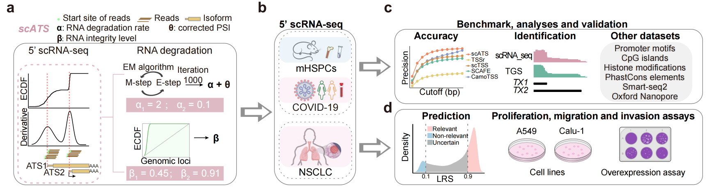

## scATS
---

**An R package for quantifying alternative transcription start site (ATS) in 5' single-cell RNA-seq data**

scATS can analyze single- or paired-end scRNA-seq data, such as that from 10X genomics, allowing for direct quantification with Seurat objects (**Fig. a,b**). This represents a significant advancement over existing ATS quantification methods. Users need to further specify the genes and cells to be included in the analysis, as well as the minimum number of each gene. With these parameters, scATS can accurately calculate expected ATS isoform abundance and perform differential analysis for specific groups (**Fig. c,d**).

To use scATS, you can follow the instructions below. The detailed installation and usage of scATS are available in our [document](./docs/_build/html/index.html).