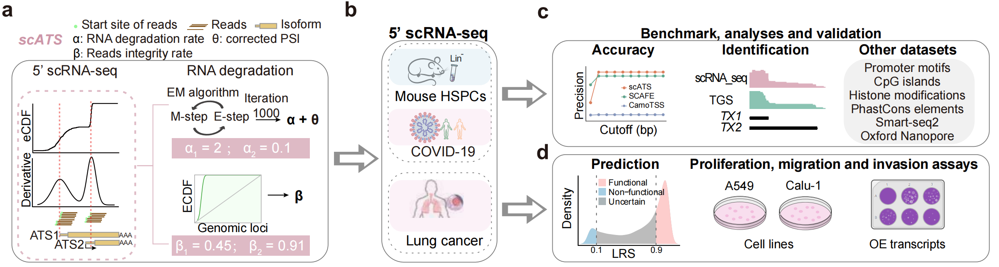

## scATS
 


**An R package for quantifying alternative transcription start site (ATS) in 5' single-cell RNA-seq data**

Here, we developed scATS, which introduces two novel metrics (**α** and **β**) to precisely quantify RNA degradation, and provides both raw (**ψ**) and corrected (**θ**) metrics to correct ATS expression profiles from resulting distortions. 

overall, scATS is a stepwise computational method, scATS, to de novo infer the relative usage of TSSs and correct the RNA degradation in the paired-end 5’ scRNA-seq.

## Contents

- [Overview](#Overview)
- [Requirements](#Requirements)
- [Installation](#Installation)
- [Quick start](#Quick-start)
  - [infer TSS](#infer-TSS)
  - [Disease model](#Disease-model)
- [Citing](#Citing)


## <span id="Overview">Overview</span>

`scATS` contains three main steps (**Fig. a**): 
1. identifing TSS in each gene according to the eCDF of the start sites of all read 1 (R1) reads.
2. quantifying an EM model based RNA degradation rate (**α**) and a degradation metric (**β**), representing the relative area under the cumulative distribution curve of each TSS.
3. providing raw percent spliced in (PSI, **ψ**) and corrected PSI values (**θ**) of each TSS account for RNA degradation.

We further applied scATS on three different 5’ scRNA-seq datasets, including mouse hematopoietic stem and progenitor cells (HSPCs), and human clinical samples from COVID-19 and lung cancer patients (**Fig. b**). Benchmark was performed in mouse HSPCs datasets. And the accuracy of our model was assessed by promoter motifs, epigenetic information, conservation and long-read sequencing (**Fig. c**). We also developed a machine-learning method to screen for the functional TSSs in lung cancer and guide subsequent experimental validation and mechanism study (**Fig. d**).




## <span id="Requirements">Requirements</span>

scATS has been developed with `R 4.0.0` and the following packages are needed to be installed in `R` (R scripts in `scATS` automatically check to see if an R library is already installed and then install those that are needed. So no need for manual preinstallation):

| Packages        |    Version   |
| -------------------- | ------------ |
| data.table           | >= 1.15.4    |
| fitdistrplus         | >= 1.2-1     |
| GenomicAlignments    | >= 1.22.1    |
| GenomicFeatures      | >= 1.38.2    |
| GenomicRanges        | >= 1.38.0    |
| ggbio                | >= 1.42.0    |
| mclust               | >= 6.1.1     |
| mixtools             | >= 2.0.0     |
| parallel             | >= 3.6.0     |
| rtracklayer          | >= 1.46.0    |
| Seurat               | >= 4.4.0     |
| SummarizedExperiment | >= 1.16.1    |

## <span id="Installation">Installation</span>

To install `scATS`, you have two options: either install directly from GitHub or use the compressed source file:

```r
# Install from GitHub if remotes package is not installed
if (!requireNamespace("remotes", quietly = TRUE))
    install.packages("remotes")

remotes::install_github("LuChenLab/r-scATS/scATS/")
```

Alternatively, you can install `scATS` using the source file downloaded from the [repository](https://github.com/LuChenLab/r-scATS/blob/main/scATS_0.5.5.tar.gz) :
```r
# Install scATS from a downloaded source file
R CMD INSTALL scATS_0.5.5.tar.gz
```


## <span id="Quick start">Quick start</span>

### <span id="infer TSS">infer TSS</span>
Now, let's test scATS with a function (TSSCDF) that directly processes 5′ scRNA-seq data stored in a Seurat object.
Before running the analysis, we first check the help message of TSSCDF.
In R, you can always access the documentation of any function using `?TSSCDF` or `help("TSSCDF")`.

```r
#--- check out the help message of TSSCDF
library(scATS)
?TSSCDF
# or
help("TSSCDF")
```

It should print the help message as the followings:

```R
TSSCDF(
  object,
  bam,
  sep = "_",
  genes,
  gtfFile,
  txdb = NULL,
  UTROnly = FALSE,
  MinGeneReads = 500,
  scDR = FALSE,
  MinscTSSReads = 5,
  mapqFilter = 255,
  isSecondaryAlignment = FALSE,
  isSupplementaryAlignment = FALSE,
  isDuplicate = NA,
  Upstream = 1000,
  min.TSS.percent = 5,
  min.local.percent = 1,
  p.cutoff = 0.01,
  window = 10,
  greedy = TRUE,
  cores = 1L,
  verbose = FALSE,
  project.name = NULL
)
```


   
| Arguments        | Description   |
| -------------------- | ------------ |
| object           | A Seurat object.    |
| bam, sep         | 	Path of bam file(s), and the character string to separate the bams.     |
| genes    | Genes used for ATS inference and quantification. By default, all genes in the Seurat object are included.   |
| gtfFile      | Path of GTF file or Granges file of GTF file.   |
| txdb      | A TxDb object.  |
| UTROnly        | Only infer ATS within annotated 5’ UTR regions or first exons of transcripts without 5’ UTR (default=True).    |
| scDR        | Whether to estimate the single-cell level degradation rate of TSS. Setting TRUE triggers an additional inference step and vastly increases runtime (default=False).   |
| MinGeneReads        | The minimum reads of a gene for TSS inference (default=500).    |
| MinscTSSReads        | Minimum reads of single-cell TSS reads for single-cell degradation rate estimation when scDR = TRUE (default=5).    |
| min.TSS.percent	     | Defines the minimum proportion of total supporting reads (i.e., the change in cumulative density, F1 – F0) that a candidate TSS region must contribute. This parameter filters out weak or noise-driven TSS peaks (default=5%).    |
| min.local.percent	    | Based on the maximum local derivative change, this parameter evaluates whether a candidate TSS region exhibits sufficiently sharp local enrichment. It is used to remove locally insignificant or low-confidence peaks (default=1%).    |
| mapqFilter, isSecondaryAlignment, isSupplementaryAlignment, isDuplicate	        | parameters for ScanBamParam to read the BAM file(s).    |
| p.cutoff      | A significance threshold used to determine whether the smoothed derivative exceeds the background derivative distribution, where the cutoff is computed from a fitted normal model. Smaller values of p.cutoff impose stricter criteria and retain only high-confidence TSS candidates (default=0.01).    |
| window      | Controls the Gaussian smoothing window and is also used to define local flanking regions and extend candidate TSS boundaries. Larger windows produce smoother trends with reduced resolution, while smaller windows increase sensitivity at the cost of higher noise (default=10).    |
| greedy     | greedy for the first annotated TSS? If this parameter is set to TRUE, the most distal annotated TSS will be printed even if it does not satisfy the specified condition (default=True).    |
| cores      | The number of cores for parallel working.(default=1).    |
| verbose      | A logical controlling if a text progress bar is displayed.(default=False).    |
| project.name	      | The name of project.(default=NULL).    |

In practice, **MinGeneReads** is a key parameter controlling the stringency of TSS detection, as it specifies the minimum number of effective reads supporting a gene required for TSS inference. To help users select an appropriate threshold, scATS provides the built-in function `loadbamgene`, which allows users to inspect the distribution of effective supporting reads per gene using their own data. For example:

```r
scATS:::loadbamgene(gene = "GATD3B",
            txdb = txdb,
            bam = bam,
            region = as("21:5079294-5128413:-", "GRanges"))
```

By examining this distribution, users may choose a suitable **MinGeneReads** value based on the sequencing depth and signal quality of their dataset. Reducing **MinGeneReads** increases the number of detected TSSs but inevitably introduces more noise, while higher values make detection more stringent.


The detailed installation and usage of scATS are available in our [document](https://r-scats.readthedocs.io/en/latest/). Demo data can be obtained from [repository](https://github.com/LuChenLab/r-scATS/tree/main/demo).


## <span id="Disease model">Disease model</span>
The pipeline for identifying disease-related TSSs is not included in the scATS R package.
All code and model related to this workflow are provided separately and can be found in [here](https://github.com/LuChenLab/r-scATS/tree/main/LRS).

### 1. Requirements

   
| Packages        | Version   |
| -------------------- | ------------ |
| pandas           | >= 2.0.3    |
| matplotlib         | >= 3.7.5     |
| numpy    | >= 1.20.3    |
| shap      | >= 0.44.1    |
| scikit-learn        | >= 1.3.2    |

The code was developed and tested in a Python 3.8 environment.
A complete Conda environment specification file (LRS.yml) is provided in [here](https://github.com/LuChenLab/r-scATS/tree/main/LRS), Users can recreate the exact environment by running:

```python
conda env create -f LRS.yml
conda activate LRS

```
### 2. model development:  
The training dataset contains 33 features. Detailed feature categories can be found in the column headers of the data file.

The dataset was split into training, validation, and test sets using **StratifiedKFold cross-validation** with `n_splits=10`, `shuffle=True`, and `random_state=42`.

Features were standardized using **StandardScaler**.

A **Random Forest** Classifier (**RandomForestClassifier**) was used as the base model.

Both preprocessing and the classifier were wrapped into a **Pipeline**, ensuring they can be saved and reloaded together.

Resources in this repository:

Training data: `dataset.xlsx`

Trained model file: `final_LRS_RF.pkl`

You can directly load these data from [here](https://github.com/LuChenLab/r-scATS/tree/main/LRS) for predictions without applying feature scaling again. Example:

```python
import pickle

# Load the trained pipeline
with open("rf_pipeline_model.pkl", "rb") as f:
    model = pickle.load(f)
```

See the detailed [documentation](file:///Users/xuzijie/Desktop/files/labsoft/r-scATS/docs/_build/html/md/Disease%20model.html#) for model training.

## <span id="Citing">Citing</span>

A pre-print is going to be uploaded soon.