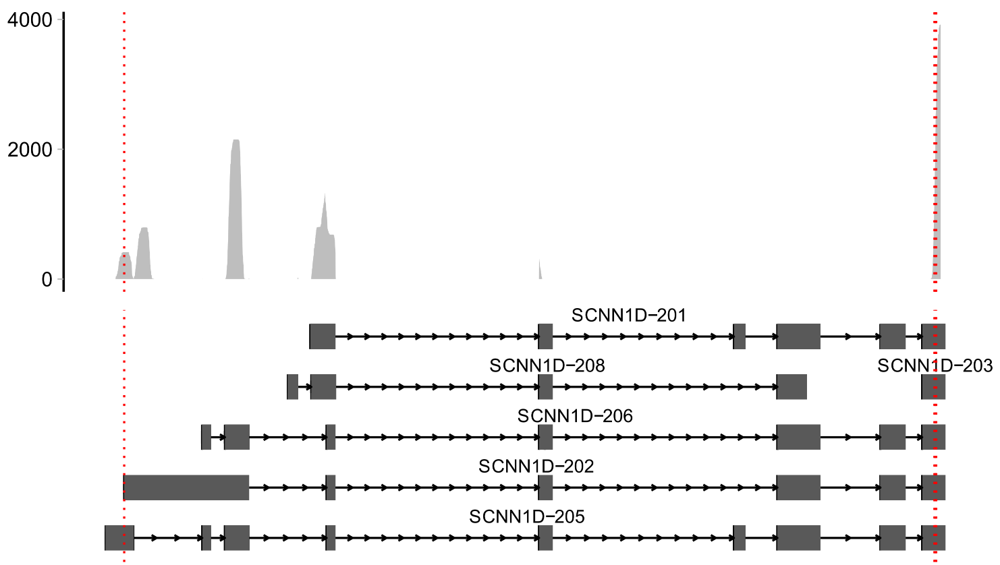

# Usage
**scATS** can analyze both single-end and paired-end 5'-end scRNA-seq data, enabling direct quantification using Seurat objects, while incorporating **RNA degradation** (RD) modeling through expectation-maximization (EM).

The main functions of scATS are: `TSSCDF`, `FindMarkersByTheta`,`FindMarkers`, `ThetaByGroup`,`psi`, `Sashimi`

## TSS inference and quantification
The input files include:
- Seurat object (R object)
- Alignment file (bam file)
- Annotation file (gtf file)

```r
# load packages
suppressMessages({
  library(scATS)
  library(Seurat)
  library(data.table)
})

# load input files
seu <- readRDS("demo/demo_seurat.Rds")
Genes <- rownames(seu)
gtfFile <- file.path("demo/demo.gtf")
bams <- "demo/demo.bam"
file.exists(bams)

# quantification using wrapper function
scats <- TSSCDF(object = seu, bam = bams, gtf = gtfFile, genes = Genes, verbose = TRUE, scDR = TRUE, UTROnly = TRUE)
scats

```
    class: scATSDataSet 
    dim: 6 2000 
    metadata(2): version parameters
    assays(4): counts psi theta alpha
    rownames(6): OR4F5@1:69071:+ OR4F5@1:69090:+ ... SCNN1D@1:1287217:+ SCNN1D@1:1287223:+
    rowData names(12): TSS gene_id ... alpha theta
    colnames(2000): TGGACGCTCCTTCAAT-1 CGAGCACGTCAGAATA-1 ... ATCGAGTAGCGGCTTC-1 CTAGAGTAGTGCCATT-1
    colData names(4): orig.ident nCount_RNA nFeature_RNA CellType
    


The quantification results are stored in  `scats@rowRanges` and contain the following columns:  

| column name      |                                           content                                          |
| ---------------- | ------------------------------------------------------------------------------------------ |
| seqnames         | The chromosomal name of the gene to which TSS belongs.  |
| ranges           | The genomic locus of TSS, where the growth rate is highest.  |
| strand           | The genomic strand of the gene to which TSS belongs.   |
| gene_id          | The Ensembl ID of the gene to which TSS belongs.   |
| gene_name        | The HGNC Symbol of the gene to which TSS belongs.   |
| TSS              | The ID of the TSS in the format of [seqnames:ranges:strand].   |
| Region           | The growth area of the sorted 5'-starts of read 1, or it can also be interpreted as the<br> TSS cluster. Another region must show a significant increase in the number of reads.   |
| PSI              | The percent spliced in (PSI) of TSS.  |
| Percent          | The ratio of TSS reads.   |
| Annotated        | The nearest annotated TSS locus that exists in the region, if it is NA, <br>indicates that there are no annotated TSS loci in the region.   |
| Greedy           | Greedy for the first TSS. If it is TRUE, it indicates that the first TSS is quantified<br> even if it does not meet the specified condition."   |
| beta             | The area under the cumulative distribution curve : close to 1, indicates no degradation,<br>while close to 0 indicates severe degradation.   |
| alpha            | The degradation index fitted using the EM algorithm: the larger the value, the more severe the degradation.    |
| theta            | The PSI value fitted using the EM algorithm.   |
| AllReads         | The total number of reads used for quantification.   |

***Note : All the following analyses are based on the `scats` object.***


## Finding differentially expressed ATSs
### Finding markers of all group

**Identifying ATS markers based on `θ` value.**

```r
DE <- scATS::FindMarkersByTheta(object = scats, groupBy = "CellType", group1 = NULL, group2 = NULL, cores = 20)
DE
```

         gene      TSS           group1 theta1   theta2   cell1  cell2 percent1 percent2     p
        <char>    <char>         <char> <num>    <num>    <int>  <int> <num>     <num>     <num>
    1:  OR4F5 OR4F5@1:69063:+      A 0.3090495 0.2476250    14     9 1.3725490 0.9183673 0.2824086
    2:  OR4F5 OR4F5@1:69063:+      B 0.2476250 0.3090495     9    14 0.9183673 1.3725490 0.2824086
    3:  OR4F5 OR4F5@1:69071:+      A 0.2092985 0.3593406    12    17 1.1764706 1.7346939 0.1862959
    4:  OR4F5 OR4F5@1:69071:+      B 0.3593406 0.2092985    17    12 1.7346939 1.1764706 0.1862959
    5:  OR4F5 OR4F5@1:69080:+      A 0.1622722 0.1533179     9     9 0.8823529 0.9183673 0.9162350
    6:  OR4F5 OR4F5@1:69080:+      B 0.1533179 0.1622722     9     9 0.9183673 0.8823529 0.9162350

The `DE` object contains following columns:

| column name      |                                           content                                          |
| ---------------- | ------------------------------------------------------------------------------------------ |
| gene             | The HGNC Symbol of the gene to which TSS belongs.   |
| TSS              | The ID of the TSS in the format of [gene_name:seqnames:ranges:strand].   |
| group1           | The levels of group.   |
| theta1/2         | The theta value of the TSS in the group.   |
| cell1/2          | The number of cell-type corresponding to group.   |
| percent1/2       | The ratio of TSS reads.  |
| p                | The p-value from the Wilcoxon test for differences in psi values among groups.   |


**Identifying ATS markers based on `ψ` value.**

```r
DE <- scATS::FindMarkers(object = scats, groupBy = "CellType", group1 = NULL, group2 = NULL, cores = 20, majorOnly = F) 
DE
```
        TSS                 G1     G2    n1    n2    N1    N2   Cells1  Cells2   PSI1   PSI2     PseudobulkPSI1
        <char>            <char> <char> <int> <int> <int> <int>  <int>  <int>   <num>   <num>          <num>
    1: OR4F5@1:69071:+      A  Other    66    58   226   207   1020    980 0.2306640 0.2385772      0.2010582
    2: OR4F5@1:69071:+      B  Other    58    66   207   226    980   1020 0.2385772 0.2306640      0.3260394
        PseudobulkPSI2 wald.test  wilcox.test  prop.test
              <num>     <num>       <num>      <num>
    1:      0.3260394 0.9230017   0.9005852 1.279065e-09
    2:      0.2010582 0.9230017   0.9005852 1.279065e-09


The `DE` object contains following columns:

| column name      |                                           content                                          |
| ---------------- | ------------------------------------------------------------------------------------------ |
| TSS              | The ID of the TSS in the format of [gene_name:seqnames:ranges:strand].   |
| G1/2             | The levels of group.   |
| n1/2             | The expression number of the TSS in the G1/2.   |
| N1/2             | The expression number of the host gene in the G1/2.   |
| Cells1/2         | The number of cell-type corresponding to G1/2.   |
| PSI1/2           | The average sum of all individual cell PSIs.   |
| PseudobulkPSI1/2   | The PSI value calculated by combining all reads and treating them as a pseudobulk sample.   |
| wald.test        | The p-value from the Wald test for differences in psi values among groups.  |
| wilcox.test      | The p-value from the Wilcoxon test for differences in psi values among groups.   |
| prop.test        | The p-value from the Proportion test for differences in psi values among groups.   |


### Finding markers of given group

```r
### based on θ value
DE <- scATS::FindMarkersByTheta(object = scats, groupBy = "CellType",group1 = "A", group2 = "B", cores = 20)
### based on  ψ value
DE <- scATS::FindMarkers(object = scats, groupBy = "CellType", group1 = "A", group2 = "B", cores = 20, majorOnly = F,gene = "OR4F5") 
```

In addition, you can specify the host genes used in the calculation by setting the `gene` parameter.


## Calculating PSI

**Calculating PSI based on `θ` value.**
```r
theta <- scATS::ThetaByGroup(object = scats, gene = "OR4F5",groupBy = "CellType")
theta
```
          Group    TSS     alpha    theta
          <char>  <char>   <num>    <num>
    1:      A 1:69090:+ 0.3766315 0.4308618
    2:      A 1:69071:+ 0.9681916 0.5691382
    3:      B 1:69090:+ 0.2349261 0.1561318
    4:      B 1:69071:+ 0.6822974 0.8438682


**Calculating PSI based on `ψ` value.**

```r
psi <- scATS::psi(object = scats, groupBy = "CellType", TSS=c("OR4F5@1:69071:+", "OR4F5@1:69090:+"))
psi
```

        TSS             groupBy Cells   N  n      mean      sd        se         ci       median Q1 Q3 mad iqr
    1 OR4F5@1:69071:+       A  1020   105 66  0.5813757 0.4859188 0.04742081 0.09403726      1  0  1   0   1
    2 OR4F5@1:69071:+       B   980   96  58  0.5856689 0.4889869 0.04990702 0.09907795      1  0  1   0   1
    3 OR4F5@1:69090:+       A  1020   105 46  0.4186243 0.4859188 0.04742081 0.09403726      0  0  1   0   1
    4 OR4F5@1:69090:+       B   980   96  42  0.4143311 0.4889869 0.04990702 0.09907795      0  0  1   0   1
       PseudobulkPSI
    1     0.4935065
    2     0.6436285
    3     0.5064935
    4     0.3563715


The `theta` or `psi` object contains following columns:

| column name      |                                           content                                          |
| ---------------- | ------------------------------------------------------------------------------------------ |
| Group/groupBy    | The level of group.   |
| TSS              | The ID of the TSS in the format of [gene_name:seqnames:ranges:strand].   |
| alpha            | The degradation index fitted using the EM algorithm.   |
| Cells            | The number of cell-type corresponding to a given groups (The same applies to the following.).   |
| N                | The expression of the host gene.   |
| n                | The expression of the TSS.   |
| mean             | The mean of PSI.  |
| sd               | The standard deviation (std) of PSI.  |
| se               | The standard error (SE) of PSI.   |
| ci               | The confidence interval (CI) of PSI.   |
| median           | The median of PSI.   |
| Q1               | The first quartile (Q1) of PSI.   |
| Q3               | The third quartile (Q3) of PSI.   |
| mad              | The median absolute deviation (MAD) of PSI.  |
| iqr              | The interquartile range (IQR) of PSI.   |
| theta/PseudobulkPSI    | The PSI value calculated by combining all reads and treating them as a pseudobulk sample.   |


## Sashimi plots

```r
# Take SCNN1D gene as an example
gene_symbol <- "SCNN1D"
tss <- GenomicRanges::start(scats@rowRanges[scats@rowRanges$gene_name==gene_symbol])
scATS::Sashimi(object = scats, 
               bam = bams,
               xlimit = c(1280352, 1287325),
               gtf = gtfFile, 
               gene = gene_symbol, 
               TSS = tss, # TSS位点
               free_y = T,#是否scale
               base_size = 12, #read部分字体大小
               rel_height=0.9, #注释/read ，小于1 read部分比例更大
               fill.color = "grey",
               line.color = "red",
               line.type = 3) -> p
p
```


```r
sessionInfo()
```

```r
    
    R version 4.5.2 (2025-10-31)
    Platform: x86_64-pc-linux-gnu
    Running under: Ubuntu 22.04.5 LTS

    Matrix products: default
    BLAS:   /usr/lib/x86_64-linux-gnu/blas/libblas.so.3.10.0
    LAPACK: /usr/lib/x86_64-linux-gnu/lapack/liblapack.so.3.10.0  LAPACK version 3.10.0

    locale:
    [1] LC_CTYPE=en_US.UTF-8       LC_NUMERIC=C
    [3] LC_TIME=zh_CN.UTF-8        LC_COLLATE=en_US.UTF-8
    [5] LC_MONETARY=zh_CN.UTF-8    LC_MESSAGES=en_US.UTF-8
    [7] LC_PAPER=zh_CN.UTF-8       LC_NAME=C
    [9] LC_ADDRESS=C               LC_TELEPHONE=C
    [11] LC_MEASUREMENT=zh_CN.UTF-8 LC_IDENTIFICATION=C

    time zone: Asia/Shanghai
    tzcode source: system (glibc)

    attached base packages:
    [1] stats     graphics  grDevices utils     datasets  methods   base

    other attached packages:
    [1] scATS_0.5.5

    loaded via a namespace (and not attached):
    [1] RcppAnnoy_0.0.22            splines_4.5.2
    [3] later_1.4.4                 BiocIO_1.20.0
    [5] bitops_1.0-9                tibble_3.3.0
    [7] R.oo_1.27.1                 polyclip_1.10-7
    [9] graph_1.88.1                xts_0.14.1
    [11] rpart_4.1.24                XML_3.99-0.20
    [13] fastDummies_1.7.5           lifecycle_1.0.4
    [15] OrganismDbi_1.52.0          ensembldb_2.34.0
    [17] globals_0.18.0              lattice_0.22-5
    [19] MASS_7.3-65                 backports_1.5.0
    [21] magrittr_2.0.4              rmarkdown_2.30
    [23] Hmisc_5.2-4                 plotly_4.11.0
    [25] yaml_2.3.12                 remotes_2.5.0
    [27] httpuv_1.6.16               otel_0.2.0
    [29] Seurat_5.3.1                sctransform_0.4.2
    [31] spam_2.11-1                 sp_2.2-0
    [33] spatstat.sparse_3.1-0       reticulate_1.44.1
    [35] ggbio_1.58.0                cowplot_1.2.0
    [37] pbapply_1.7-4               DBI_1.2.3
    [39] RColorBrewer_1.1-3          abind_1.4-8
    [41] Rtsne_0.17                  GenomicRanges_1.62.1
    [43] mixtools_2.0.0.1            purrr_1.2.0
    [45] R.utils_2.13.0              AnnotationFilter_1.34.0
    [47] biovizBase_1.58.0           BiocGenerics_0.56.0
    [49] RCurl_1.98-1.17             nnet_7.3-20
    [51] VariantAnnotation_1.56.0    IRanges_2.44.0
    [53] S4Vectors_0.48.0            ggrepel_0.9.6
    [55] irlba_2.3.5.1               listenv_0.10.0
    [57] spatstat.utils_3.2-0        goftest_1.2-3
    [59] RSpectra_0.16-2             spatstat.random_3.4-3
    [61] fitdistrplus_1.2-4          parallelly_1.46.0
    [63] smoother_1.3                codetools_0.2-19
    [65] DelayedArray_0.36.0         tidyselect_1.2.1
    [67] UCSC.utils_1.6.1            farver_2.1.2
    [69] base64enc_0.1-3             matrixStats_1.5.0
    [71] stats4_4.5.2                spatstat.explore_3.6-0
    [73] Seqinfo_1.0.0               GenomicAlignments_1.46.0
    [75] jsonlite_2.0.0              Formula_1.2-5
    [77] progressr_0.18.0            ggridges_0.5.7
    [79] survival_3.8-3              segmented_2.1-4
    [81] tools_4.5.2                 ica_1.0-3
    [83] Rcpp_1.1.0                  glue_1.8.0
    [85] gridExtra_2.3               SparseArray_1.10.8
    [87] xfun_0.55                   TTR_0.24.4
    [89] MatrixGenerics_1.22.0       GenomeInfoDb_1.46.2
    [91] dplyr_1.1.4                 BiocManager_1.30.27
    [93] fastmap_1.2.0               digest_0.6.39
    [95] R6_2.6.1                    mime_0.13
    [97] colorspace_2.1-2            scattermore_1.2
    [99] tensor_1.5.1                dichromat_2.0-0.1
    [101] spatstat.data_3.1-9         RSQLite_2.4.5
    [103] cigarillo_1.0.0             R.methodsS3_1.8.2
    [105] tidyr_1.3.2                 generics_0.1.4
    [107] data.table_1.17.8           rtracklayer_1.70.0
    [109] httr_1.4.7                  htmlwidgets_1.6.4
    [111] S4Arrays_1.10.1             uwot_0.2.4
    [113] pkgconfig_2.0.3             gtable_0.3.6
    [115] blob_1.2.4                  lmtest_0.9-40
    [117] S7_0.2.1                    XVector_0.50.0
    [119] htmltools_0.5.9             dotCall64_1.2
    [121] RBGL_1.86.0                 ProtGenerics_1.42.0
    [123] SeuratObject_5.3.0          scales_1.4.0
    [125] Biobase_2.70.0              png_0.1-8
    [127] spatstat.univar_3.1-5       rstudioapi_0.17.1
    [129] knitr_1.51                  reshape2_1.4.5
    [131] rjson_0.2.23                checkmate_2.3.3
    [133] nlme_3.1-168                curl_7.0.0
    [135] cachem_1.1.0                zoo_1.8-15
    [137] stringr_1.6.0               KernSmooth_2.23-26
    [139] parallel_4.5.2              miniUI_0.1.2
    [141] foreign_0.8-90              AnnotationDbi_1.72.0
    [143] restfulr_0.0.16             pillar_1.11.1
    [145] grid_4.5.2                  vctrs_0.6.5
    [147] RANN_2.6.2                  VGAM_1.1-14
    [149] promises_1.5.0              xtable_1.8-4
    [151] cluster_2.1.8.1             htmlTable_2.4.3
    [153] evaluate_1.0.5              GenomicFeatures_1.62.0
    [155] cli_3.6.5                   compiler_4.5.2
    [157] Rsamtools_2.26.0            rlang_1.1.6
    [159] crayon_1.5.3                future.apply_1.20.1
    [161] mclust_6.1.2                plyr_1.8.9
    [163] stringi_1.8.7               viridisLite_0.4.2
    [165] deldir_2.0-4                BiocParallel_1.44.0
    [167] Biostrings_2.78.0           lazyeval_0.2.2
    [169] spatstat.geom_3.6-1         Matrix_1.7-4
    [171] BSgenome_1.78.0             RcppHNSW_0.6.0
    [173] patchwork_1.3.2             bit64_4.6.0-1
    [175] future_1.68.0               ggplot2_4.0.1
    [177] KEGGREST_1.50.0             shiny_1.12.1
    [179] SummarizedExperiment_1.40.0 kernlab_0.9-33
    [181] ROCR_1.0-11                 igraph_2.2.1
    [183] memoise_2.0.1               bit_4.6.0


```